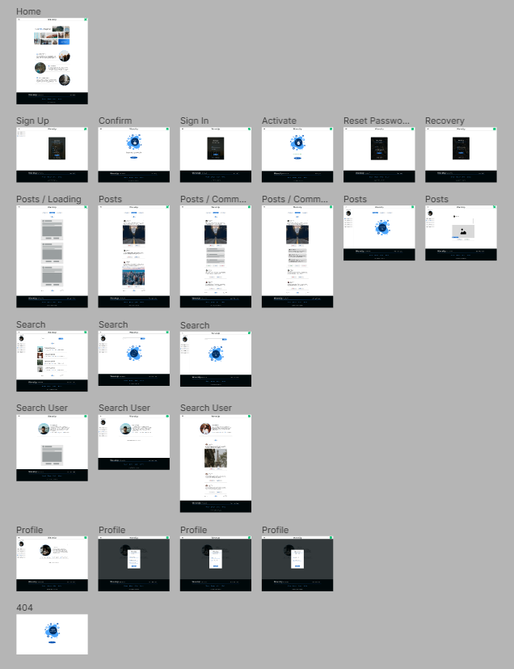

# WaveUp - Social Media - Frontend

Welcome to WaveUp, a social media application where you can connect with friends, share your thoughts, experiences and memories through posts.
This README file provides an overview of the application, its features, and instructions for getting started. This repository contains Frontend of WaveUp application, built using React.

## Important
- You can find server application at following link - [Waveup Backend](https://github.com/JBR-Sapeta/JS--Express--WaveUp)


## Project Overview

### Features
- **Internationalization**: application supports 2 languages - Polish and English.
- **User Registration**: Users can create an account on WaveUp by providing their accountname, email address, and password. Once registered, they can log in to their accounts.
- **Account Activation**: After registering, users are required to complete an email verification process.The user needs to click on the activation link sent to their email in order to verify and activate their account. 
- **Account Recovery**: When a user realizes they cannot access their account due to a forgotten password, they can initiate the account recovery process and set new password.
- **User Profile**: Each user has a profile that showcases their data and posts. Users can customize their profile by adding personal information and uploading a profile picture.
- **Post Creation**: Users can create posts to share their thoughts, ideas, or experiences. They can include text, images, or both in their posts.
- **Post Interactions - Comments**: Users can add comments to posts, allowing for discussions and conversations around specific topics.
- **Post Interactions - Likes**: Users can express their appreciation for posts by adding likes to them.
- **Search**: Users can search for other users using username, or account names.
- **Posts Listing and Pagination**: Users can scroll through the list of posts to explore content. Pagination divides posts into pages, displaying a specific number of posts per page. User can also filter posts based on date.
- **Hide/Show Posts**: If posts violate community guidelines administrators have the ability to hide them  from the public. Administrator can also delete them
- **Moderate Comments**: Administrators can moderate comments. Inappropriate or offensive comments can be changed, ensuring that discussions remain respectful and within the community guidelines.
- **Ban/Unban Users**: Administrators have the authority to ban or unban users from the platform. This feature allows them to address user behavior that violates the platform's policies. 


###  Application Triller
In this video, you'll get a comprehensive overview of the application's features.
[](https://youtu.be/vZyUiabLg1g)

###  Prototype in Figma
The frontend prototype was developed using Figma. 





###  Application Views

#### Home Page


#### Home Sign Up


#### Home Posts


#### Home Profile


#### Home Search


### Technologies Used

WaveUp is built using the following key technologies and dependencies:
- React - 18.2.0
- React Dom - 18.2.0
- React i18next - 12.3.1
- React Icons - 4.8.0
- React-router-dom - 6.10.0
- React Redux - 8.0.5
- Redux Toolkit - 1.9.3
- Axios - 1.3.5
- Framer Motion - 10.12.16
- Secure-ls - 1.2.
- Typescript - 4.9.3
- Vite - 4.2.0
- i18next - 22.5.1
- i18next-browser-languagedetector - 7.0.2
- i18next-http-backend - 2.2.1

## Getting Started
To run the WaveUp application locally, follow these steps:

### Prerequisites
Before running the WaveUp, make sure you have the [Node.js](https://nodejs.org/en) installed.

### Getting Started
To get started with WaveUp, follow these steps:

**1.  Download code or clone the repository.**

**2.	Navigate to the project directory.**

**3.	Install the dependencies:**
```
npm install
```
**4.	Start the application:**
Run in development mode:
```
npm run dev
```

**6. Open your web browser and visit http://localhost:3000/ to access WaveUp Application**

### Production 

1.  Builds the app for production to the `dist` folder.
```
npm run build
```

2.  Run in production mode:
```
npm run preview
```
